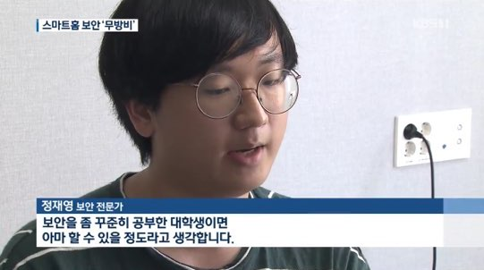
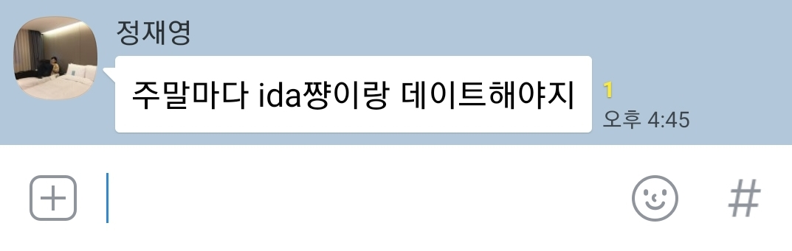

# jjyer

JJYER - Jeong Jae Young Exploit Robot

JJYER is a high-performance automatic exploit generation robot. This is mainly used in ReverseLab & ICEWALL. Feel free to use this tool :)

## Features

- `getflag [challenge name]` : Return the flag of a target challenge.
- `getshell [host]` : Return the interactive shell command of remote host.
- `밥사줄게` : Reset a tool status. Enter it when refreshing is needed. (ex. when fall in sleeping)
- `커피사줘` : Return a cup of coffee. (sometimes it returns the error message `꺼져`)
- `밥사줘` : Return a meal. (recommended to use it after entering the command `밥사줄게`) 

## Installation

There's no clone of source code and compiled executables. You must use it physically.

## Screenshot

